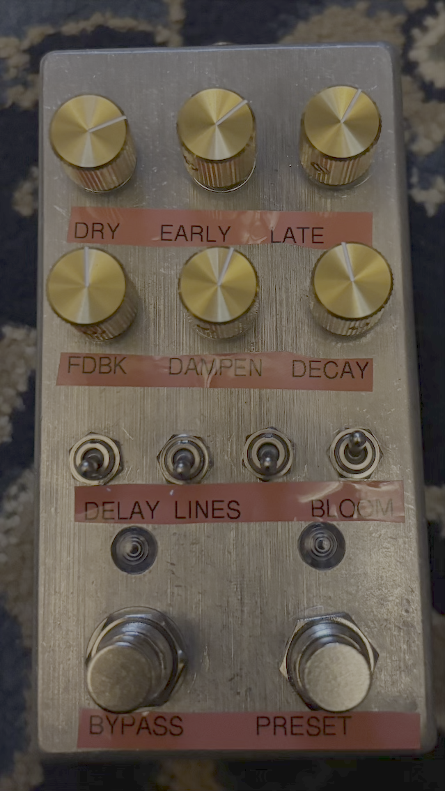

# Enhanced Preset Fork
This is a fork from https://github.com/optilude/DaisyCloudSeed a fork that improved preset usability

This fork extends those capabilities and adds a few extras:

- Switch remap: SW1 selects delay-line count (2 vs. the preset maximum), SW3 engages a
  classic Reverse Delay, SW4 routes that reverse (off = into the reverb's wet tail, on =
  straight into the output mix), and SW2 keeps the "Bloom" effect, similar to a "reverse
  reverb" (Bloom reverses the order of tap gains. Has no effect on patches with a single tap.)
- Per-preset knob mapping: each preset's `[preset.knob_map]` in
  [presets.toml](presets.toml) assigns all six knobs a primary function and a **secondary**
  function reached by holding the **preset footswitch (FS 2)** down
- More program storage (Moved the application to SRAM)
- Wider range of preset support offered by placing a limit on the number of delay lines for each preset
- *Through the Looking Glass* is available as preset 9 (Delay lines capped at 4 for this one only)
- *Dark Plate*: Preset #10 mostly adapted from from Ghost Note Audio's CloudSeedCore
- Delay line count is toggled by SW1 (off = 2 lines, on = the preset's maximum, up to 5)
- Bypass state is saved between power cycles
- Agent-guided performance optimizations
- Reduced 1khz whine while active or bypassed 
- Presets are defined in [presets.toml](presets.toml), not in C++. The file is compiled into
  the firmware image and parsed at boot; edit values there and reflash

# DaisyCloudSeed (GuitarML fork for Terrarium)
Cloud Seed is an open source algorithmic reverb plugin under the MIT license, which can be found at [ValdemarOrn/CloudSeed](https://github.com/ValdemarOrn/CloudSeed).
DaisyCloudSeed is a port to the Daisy environment for running on a Daisy Patch unit. This code (GuitarML's fork) further modifies DaisyCloudSeed
for use on the Terrarium guitar pedal. The processing has been changed to mono (from stereo), which allows up to 5 delay lines,
and fills out all of the Terrarium's controls. 



Download the cloudseed.bin for Daisy Seed from the [Releases](https://github.com/GuitarML/DaisyCloudSeed/releases) page.

## Getting started
The new code for Terrarium has been added to ```DaisyCloudSeed/petal```.
Build the daisy libraries and CloudSeed with (after installing the Daisy Toolchain):
```
make libs
make
```

Then flash your terrarium with the following commands (or use the [Electrosmith Web Programmer](https://electro-smith.github.io/Programmer/))
**NOTE** This fork (of a fork) uses BOOT_SRAM, so you'll need to program the bootloader accordingly. A hardware bug in either the bootloader or your Daisy itself may also require you to follow a goofy little procedure to actually get program-dfu to work
```
# from the petal/CloudSeed directory...
# using USB (after entering bootloader mode)
make program-boot
# Hit restart and then hold Boot on your DaisySeed until you see a rapid blink
make program-dfu
```

## Editing presets

All ten presets live in [presets.toml](presets.toml) at the repo root - names, LED blink
timing, the per-preset delay-line cap, and all 45 reverb parameters. The file is embedded into
the firmware image, so changing a preset is:
```
# edit presets.toml, then:
make                 # validates presets.toml, then builds
make program-dfu
```
`make` runs the file through the same parser the pedal uses and refuses to build firmware if it
fails: unknown or misplaced parameters, a missing group, an unknown preset or top-level key, a
bad range, TOML syntax errors, or a document too large for the boot-time parse arena. So a
broken preset file can no longer reach the pedal - where the only symptom would be **both**
LEDs blinking together at 5 Hz with no audio.

`make presets-check` runs the same check without building firmware. It fails only on a file the
parser rejects; preset values themselves are free to change.

Preset order is stored in flash: append new `[[preset]]` entries at the end, and bump
`SETTINGS_VERSION` in `cloudseed.cpp` if you reorder or delete any.

## Knob mapping

Every preset carries a `[preset.knob_map]` table naming what each knob does:

```toml
[preset.knob_map]
knob1_a = "output.DryOut"        # primary: knob 1 normally
...
knob1_b = "input.PreDelay"       # secondary: knob 1 while FS 2 is held
knob6_b = "reverse.delay"        # the reverse-delay window length
```

Each value is a quoted `"group.Parameter"` naming a parameter from that preset's own
`[preset.params.<group>]` section, or the pseudo-target `"reverse.delay"`. All twelve keys are
required and `make` rejects an unknown knob key, an unknown group or parameter, a parameter
that lives in a different group, and `LineCount`/`isReverse` (those belong to SW1/SW2).

Knobs are **absolute**: once a knob has taken over, its position is the parameter value. After
power-up, a preset change, or switching knob banks (including letting go of FS 2)
every knob is *parked* and writes nothing, so a freshly loaded preset sounds exactly as authored -
even with a knob sitting at a stop. The first deliberate turn takes the parameter to the knob's
position with a 50 ms glide from its current value (no step, no click), and from then on the
parameter follows the knob 1:1. The stops are exact: fully counter-clockwise is 0.0 (that is
what makes the three output-level knobs silence the pedal) and fully clockwise is 1.0. A knob
dialled in the secondary bank is parked when you release the footswitches; its next turn glides
its primary target to the knob's position.

Holding FS 2 is a gesture, not a tap: the bank stays on the secondary map until FS 2 is
released. If any secondary knob changed a parameter during the hold, the release does nothing;
if none did, the release cycles to the next preset as a tap would. A knob brushed by less than
1% of its travel does not count.

`input.HighPass` and `input.LowPass` switch their filter on the first time their knob is
turned; every other gated parameter (the shelves, the in-loop cutoff, the diffusers) must be
enabled in `[preset.params.*]` to be audible.

# Control

| Control | Description | Comment |
| --- | --- | --- |
| Ctrl 1 | Dry Level | Adjusts the Dry level out |
| Ctrl 2 | Early Reverberation Level | Adjusts the Early Reverb stage output.  |
| Ctrl 3 | Late Reverberation Level | Adjusts the Late Reverb stage output |
| Ctrl 4 | Late Reverberation Feedback | Adjusts amount of signal fed back through the late diffusion allpass chain. |
| Ctrl 5 | Early Reverberation Dampening | Controls amount of dampening for the early reverb stage. Actual parameter name is "TapDecay" |
| Ctrl 6 | Late Reverberation Decay | Adjust the decay time of the late reverberation stage. |
| SW 1 | Delay Lines | Off = 2 delay lines; On = the current preset's maximum (5, or 4 for "Through the Looking Glass"). |
| SW 2 | Bloom | Reverses the order of multi-tap delay gains, resulting in subsequent taps getting louder rather than quietier. |
| SW 3 | Reverse Delay | Off = dry + reverb only; On = enables the reverse voice, routed per SW4 (into the reverb tail, or mixed straight into the output). Its window length is the knob mapped to `reverse.delay` (Ctrl 6 secondary by default). |
| SW 4 | Reverse Routing | Chooses where the SW3 reverse goes. Off = into the reverb (the reversed guitar feeds the wet tail; the forward dry pass-through stays clean via dry-gain cancellation). On = direct mix (a reversed copy of the reverb output is mixed straight into the output). Only audible when SW3 is on. |
| FS 1 | Bypass/Active | Bypass / effect engaged. Acts on **release**; works the same while FS 2 is held. |
| FS 2 | Cycle Preset | Tap: loads the next available Preset, starts at beginning after the last in the list. Acts on **release**. These are the same as the original Cloud Seed plugin presets, except for "Through the Looking Glass" |
| FS 2 (held) | Secondary knob bank | While held, every knob controls its `knobN_b` target instead of `knobN_a`. The release skips the preset change if a secondary knob was turned during the hold. |
| LED 1 | Bypass/Active Indicator |Illuminated when effect is set to Active |
| LED 2 | Preset indicator | Number of flashes = current preset number |
| Audio In 1 | Audio input | Mono only for Terrarium |
| Audio Out 1 | Mix Out | Mono only for Terrarium |
